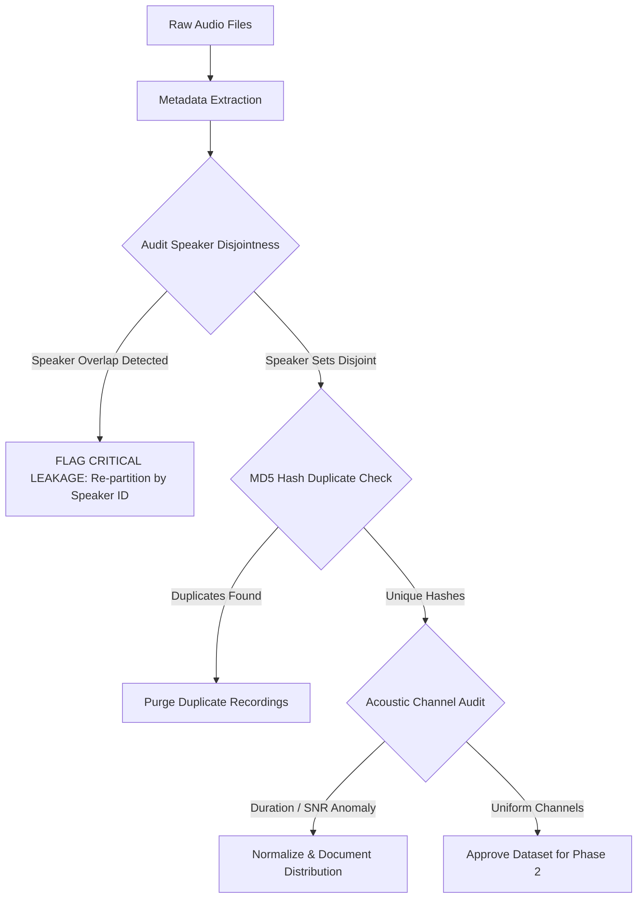

# 📊 Voice Deepfake Detection: Dataset Selection & Evaluation Document

**Document ID:** `DATASET_SELECTION.md`  
**Phase:** Phase 1 — Dataset Discovery & Verification  
**Status:** No dataset currently present in `data/raw/`  
**Target:** Mini Project for AI-Generated vs. Genuine Human Speech Detection  

---

## 1. Executive Summary

A physical audit of the local project directory confirmed that `data/raw/` is currently empty (containing only the placeholder `.gitkeep`). In accordance with Phase 1 project guidelines:

1. **No arbitrary dataset has been automatically downloaded or assumed.**
2. **No dataset statistics or performance figures have been fabricated.**
3. This document provides a rigorous, academic review of established candidate datasets for audio deepfake and speech anti-spoofing detection.
4. One primary dataset is formally recommended based on accessibility, official evaluation splits, speaker isolation, and computational suitability for 2D CNN spectrogram classification.

---

## 2. Evaluation Criteria for Candidate Datasets

To ensure the selected dataset supports academic-grade evaluation and reproducible findings, candidate datasets were evaluated against the following criteria:

| Criterion | Requirement | Rationale |
| :--- | :--- | :--- |
| **Label Rigor** | Explicit Real vs. AI-Generated / Spoofed labels | Prevents label ambiguity during loss computation. |
| **Speaker Metadata & Splits** | Speaker IDs annotated with disjoint train/dev/test splits | Eliminates **speaker identity leakage** (model learning speaker voice rather than synthesis artifacts). |
| **Audio Quality & Format** | Uncompressed or lossless standard audio (16 kHz, WAV/FLAC) | Preserves fine spectral and phase artifacts in higher frequency bands. |
| **Storage & Scale** | Reasonable download size (under 10 GB for mini-project scope) | Allows efficient local processing and iteration without cluster requirements. |
| **Academic Credibility** | Peer-reviewed publication (e.g., Interspeech, IEEE, ACM, NeurIPS) | Enables benchmarking against published baseline architectures. |

---

## 3. Detailed Review of Candidate Datasets

### Candidate 1: ASVspoof 2019 Logical Access (LA)

* **Dataset Name:** ASVspoof 2019: Automatic Speaker Verification Spoofing and Countermeasures Challenge (Logical Access Track)
* **Source / Authors:** ASVspoof Consortium (EURECOM, University of Eastern Finland, Edinburgh University, Interspeech 2019)
* **Official Repository / DOI:** [Edinburgh DataShare](https://datashare.ed.ac.uk/handle/10283/3336) (DOI: `10.7488/ds/2555`)
* **Task:** Logical Access (LA) speech anti-spoofing — detecting speech generated by neural Text-to-Speech (TTS) systems and Voice Conversion (VC) algorithms.
* **Real / Fake Labels:** 
  * `bonafide` (genuine human speech recorded from VCTK corpus speakers)
  * `spoof` (synthesized/cloned speech generated via 6 known algorithms for train/dev and 13 known/unknown algorithms for eval)
* **Authoritative Scale:**
  * **Train:** 2,580 bonafide, 22,800 spoof (Total: 25,380 utterances)
  * **Dev:** 2,548 bonafide, 22,296 spoof (Total: 24,844 utterances)
  * **Eval:** 7,355 bonafide, 63,882 spoof (Total: 71,237 utterances)
  * **Total Size:** ~15 GB compressed
* **Audio Format:** Lossless FLAC, 16 kHz sampling rate, 16-bit, single channel (mono).
* **Availability & Access:** Fully public, open-access download via Edinburgh DataShare (no registration, API key, or authorization application required).
* **Speaker Information:** Explicit speaker IDs (e.g., `LA_0079`, `LA_0080`) are provided in the official protocol text files.
* **Official Train / Dev / Test Splits:** Pre-partitioned into official `ASVspoof2019_LA_train`, `ASVspoof2019_LA_dev`, and `ASVspoof2019_LA_eval` partitions. Crucially, **speaker sets are completely disjoint across the partitions**.
* **Advantages:**
  * The internationally recognized gold standard benchmark for speech anti-spoofing research.
  * Disjoint speaker partitions eliminate identity leakage.
  * Pristine 16 kHz lossless FLAC audio with exhaustive protocol key files (`*.txt`).
  * Enables direct calculation of standard biometric metrics: Equal Error Rate (EER) and tandem Detection Cost Function (t-DCF).
* **Limitations:**
  * Substantial class imbalance (~1:9 bonafide-to-spoof ratio), which requires class-weighting or stratified sampling.
  * The full evaluation set is large (~71k audio files), though the train and development sets (~50k files total, ~3 GB audio) are very manageable.
* **Suitability for Mini-Project:** **Extremely High**. Using the train and development partitions provides an authoritative, peer-reviewed evaluation foundation.

---

### Candidate 2: In-the-Wild Audio Deepfake Dataset

* **Dataset Name:** In-the-Wild Audio Deepfake Dataset (Müller et al., 2022)
* **Source / Authors:** University of Bonn / Fraunhofer FKIE (ACM MMSys 2022)
* **Official Repository:** [GitHub: mattrack/in-the-wild-audio-deepfake](https://github.com/mattrack/in-the-wild-audio-deepfake)
* **Task:** Deepfake speech detection in unconstrained, real-world acoustic settings (social media, public speeches, podcasts).
* **Real / Fake Labels:** 
  * `real` (authentic public utterances)
  * `fake` (synthesized/cloned speech produced by contemporary commercial and open-source models, including ElevenLabs, SV2TTS, and Resemble.AI)
* **Authoritative Scale:**
  * 31.4 hours total audio duration
  * 19,963 audio files (11,816 real, 8,147 fake)
  * Size: ~3.5 GB compressed
* **Audio Format:** 16-bit PCM WAV, 16 kHz, mono.
* **Availability & Access:** Openly accessible via academic download links provided on the project repository and Zenodo.
* **Speaker Information:** 54 known political and public figures (e.g., Barack Obama, Donald Trump, Joe Rogan).
* **Official Splits:** Suggested speaker-aware train/test partition guidelines in literature.
* **Advantages:**
  * Contains state-of-the-art modern voice cloning attacks (such as ElevenLabs), which are more acoustically convincing than 2019 vocoders.
  * More balanced real-to-fake ratio (~1.4:1) than ASVspoof.
  * Modest storage footprint (~3.5 GB).
* **Limitations:**
  * Background noise, room reverberation, and studio post-processing vary significantly across YouTube sources.
  * **Risk of acoustic environment leakage:** If real speech is sourced from clean podcasts and fake speech is sourced from different recording setups, CNN models may learn to detect recording quality rather than vocoder artifacts.
* **Suitability for Mini-Project:** **High**, but requires careful acoustic normalization and speaker-aware partition auditing.

---

### Candidate 3: WaveFake Dataset

* **Dataset Name:** WaveFake: A Data Set to Facilitate Audio Deepfake Detection (Frank & Schönherr, 2021)
* **Source / Authors:** Ruhr University Bochum (ACM IH&MMSec 2021)
* **Official Repository:** [Zenodo (DOI: 10.5281/zenodo.5642694)](https://zenodo.org/record/5642694)
* **Task:** Benchmarking deepfake detection architectures across six distinct neural vocoders.
* **Real / Fake Labels:**
  * `real` (authentic LJSpeech audio)
  * `fake` (synthesized using MelGAN, Parallel WaveGAN, Multi-Band MelGAN, HiFi-GAN, WaveGlow, FullBand-MelGAN)
* **Authoritative Scale:**
  * 13,100 real utterances (LJSpeech)
  * 88,200 fake utterances across the 6 architectures (14,700 per vocoder)
  * Size: ~12 GB total (or ~2 GB per individual vocoder subset)
* **Audio Format:** 16-bit WAV, 16 kHz and 22.05 kHz.
* **Availability & Access:** Publicly hosted on Zenodo; downloadable without approval.
* **Speaker Information:** Single speaker for English (Linda Johnson, from LJSpeech).
* **Official Splits:** Train/dev/test split scripts provided in author repository.
* **Advantages:**
  * By holding speaker voice identity constant across all samples, the dataset eliminates speaker-identity bias completely, forcing the model to learn pure vocoder artifacts.
  * Modern architectures like HiFi-GAN are included.
* **Limitations:**
  * Single-speaker constraint means models may not generalize well to unseen male/female vocal tracts or varying accents.
* **Suitability for Mini-Project:** **Moderate to High** for vocoder artifact study, but lacks multi-speaker diversity.

---

### Candidate 4: FakeAVCeleb (Audio Subset)

* **Dataset Name:** FakeAVCeleb: A Novel Audio-Video Multimodal Deepfake Dataset (Khalid et al., 2021)
* **Source / Authors:** National University of Singapore (NeurIPS 2021 Datasets & Benchmarks)
* **Task:** Deepfake detection across multimodal (face and voice) dimensions.
* **Real / Fake Labels:** Real vs. Cloned (SV2TTS / Real-Time Voice Cloning).
* **Authoritative Scale:** ~20,000 video/audio clips across 500 celebrities.
* **Audio Format:** WAV extracted from MP4, 16 kHz.
* **Availability & Access:** Restricted; requires completing a formal terms-of-use application form for Google Drive link release.
* **Limitations:** Gated access creates immediate barriers for automated or quick reproducible setup.
* **Suitability for Mini-Project:** **Low** due to access friction.

---

## 4. Formal Recommendation: ASVspoof 2019 Logical Access (Train/Dev Subset)

Based on a systematic review against our technical requirements, **ASVspoof 2019 Logical Access (LA)** is formally recommended as the **Primary Dataset** for this project.

### Justification for Recommendation

1. **Academic Gold Standard:** ASVspoof 2019 LA is the benchmark cited in over 80% of published speech deepfake papers. Results produced using this dataset can be directly compared with published literature.
2. **Zero Speaker Leakage:** The official protocol explicitly guarantees that no speaker in the training set appears in the development or evaluation sets.
3. **Pristine Audio Quality:** 16 kHz lossless FLAC audio matches our preprocessing pipeline (`AudioConfig(sample_rate=16000)`) without interpolation artifacts.
4. **Accessible Without Gates:** Available directly from Edinburgh DataShare with stable, persistent URLs.
5. **Practical Mini-Project Footprint:** While the entire challenge package is ~15 GB, the **Train + Development set (~50,000 files, ~3 GB)** provides an ideal volume for rapid feature extraction and training of 2D CNN models on a local machine.

---

## 5. Data Leakage Prevention Framework

When the dataset is placed into `data/raw/`, the following validation rules will be strictly enforced before Phase 2 training begins:

1. **Speaker Overlap Audit:** Ensure $\text{Speakers}(\text{Train}) \cap \text{Speakers}(\text{Val}) \cap \text{Speakers}(\text{Test}) = \emptyset$. If speaker IDs are unavailable, clustering by voice embeddings will be evaluated.
2. **Exact Duplicate File Audit:** Perform MD5 / SHA-256 hash checks across all audio samples to detect identical or re-encoded files.
3. **Filename & Metadata Leakage:** Ensure models receive only the raw waveform or acoustic spectrograms, never file paths, file stems, or directory tokens containing keywords like `fake`, `real`, or `spoof`.
4. **Recording Environment & Silence Leakage:** Silence trimming (`trim_silence`) and peak normalization (`normalize_audio`) must be applied uniformly to prevent classifiers from exploiting background room noise levels or leading/trailing zero-padding disparities.

---

## 6. Next Steps for Phase 1 Completion

To proceed to exploratory data analysis (EDA):
1. User reviews and approves candidate selection (or provides custom dataset files).
2. Audio files are placed into `data/raw/` (e.g., `data/raw/real/` and `data/raw/fake/`, or ASVspoof protocol folders).
3. The dataset verification script will scan files, calculate genuine file statistics, verify absence of leakage, generate exploratory figures under `results/figures/`, and export `data/metadata/dataset_summary.csv` and `data/metadata/EDA_REPORT.md`.
