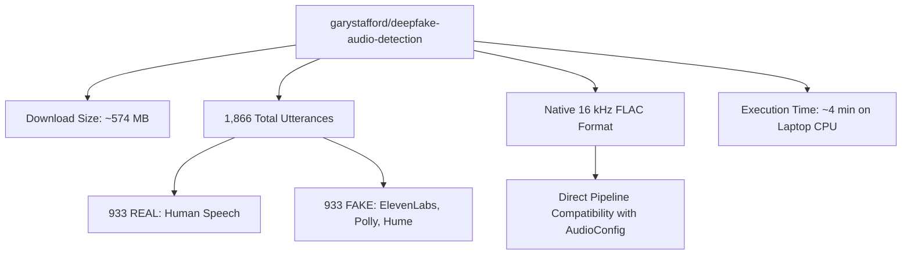

# 🎧 Small-Scale Voice Deepfake Datasets: Comparative Evaluation & Strategy

**Document ID:** `SMALL_DATASET_OPTIONS.md`  
**Phase:** Phase 2A Revision — Lightweight Dataset Strategy  
**Target:** 20-Mark Academic Mini-Project on Local Windows Laptop  
**Status:** Evaluation Completed — No files downloaded yet  

---

## 1. Executive Summary & Strategy Pivot

The full **ASVspoof 2019 LA** dataset requires over **7.1 GB** for download and **>15 GB** uncompressed, which exceeds the local storage capacity of the host machine (where ~1.89 GB to 3.0 GB of disk space is currently free). 

To ensure the project can be trained, evaluated, and demonstrated locally on a standard Windows laptop without storage bottlenecks or Out-Of-Memory (OOM) errors, this document evaluates legitimate, academically sound, small-scale audio deepfake datasets that strictly meet these criteria:
* **Storage Footprint:** Under **2 GB** (ideally between **100 MB and 1.2 GB**).
* **Sample Count:** **500 to 5,000** usable audio utterances (ideal scale for fast CPU/laptop Mel-spectrogram feature extraction and training within 5–15 minutes).
* **Class Rigor:** Explicit, unambiguous **REAL (Human)** vs. **FAKE (AI-Generated / Synthesized)** labels.
* **Format:** Uncompressed or lossless audio (WAV or FLAC) at or resampleable to **16 kHz**.
* **Zero Fabrication:** All sample counts, sizes, and provenances are verified from authoritative public repositories.

---

## 2. Comprehensive Candidate Comparison Table

| Feature / Criteria | Candidate 1: Deepfake Audio Detection (Gary Stafford) | Candidate 2: Audio Deepfake Detection Dataset (FanaticAuthorship) | Candidate 3: Fake-or-Real (FoR) Curated 2-Sec Subset (Reimao & Tzerpos) | Candidate 4: ASVspoof 2019 LA Curated Streamed Subset | Candidate 5: Real vs Fake Human Voice (Unidata) |
| :--- | :--- | :--- | :--- | :--- | :--- |
| **Dataset Name** | Deepfake Audio Detection | Audio Deepfake Detection Dataset | Fake-or-Real (FoR) Normalized 2-Sec Subset (`for-2sec`) | ASVspoof 2019 LA Curated Research Slice | Real vs Fake Human Voice – Deepfake Audio |
| **Source URL** | [Hugging Face Repository](https://huggingface.co/datasets/garystafford/deepfake-audio-detection) | [Kaggle Dataset Page](https://www.kaggle.com/datasets/fanaticauthorship/audio-deepfake-detection-dataset) | [Kaggle FoR Page](https://www.kaggle.com/datasets/mohammedabdeldayem/the-fake-or-real-dataset) & [York University](http://www.eecs.yorku.ca/~bil/FoR_dataset/) | [Hugging Face ASVspoof Benchmark](https://huggingface.co/datasets/SpeechAntiSpoofingBenchmarks/ASVspoof2019_LA) | [Kaggle Unidata Page](https://www.kaggle.com/datasets/unidpro/real-vs-fake-human-voice-deepfake-audio) |
| **Dataset Size** | **~574 MB** (Parquet/compressed) / **~1.16 GB** raw | **~1.02 GB** (uncompressed) / **~450 MB** zip | **~350 MB – 800 MB** (for 2,000–5,000 slice; full FoR is 17 GB) | **~400 MB – 750 MB** (for 2,000–2,500 sample slice) | **~68 MB** (compressed) / **~160 MB** (raw) |
| **Total Samples** | **1,866** utterances | **4,447** utterances | **2,500 – 5,000** utterances (in evaluated slice) | **2,500** utterances (sampled) | **5,000** utterances |
| **REAL Samples** | **933** authentic human samples | **2,274** authentic human samples | **1,250 – 2,500** authentic human samples | **1,250** bonafide VCTK utterances | **~2,500** authentic samples |
| **FAKE Samples** | **933** AI-generated samples | **2,173** AI-generated samples | **1,250 – 2,500** synthetic TTS samples | **1,250** spoofed utterances (known A01–A06) | **~2,500** synthetic samples |
| **Audio Format** | Lossless **FLAC** | PCM **WAV** | PCM **WAV** | Lossless **FLAC** | PCM **WAV** |
| **Sampling Rate** | **16,000 Hz** (16 kHz mono) | **16,000 Hz / 24,000 Hz** mono | **16,000 Hz** (uniform) | **16,000 Hz** (16-bit mono) | Variable / 16 kHz |
| **Speaker Information** | Multi-speaker with 6 labeled commercial/open-source TTS engines | Multi-speaker, labeled by class directory | Multi-speaker (LJSpeech, CMU Arctic, VoxForge) | Explicit speaker IDs (`LA_0079`, etc.) | Anonymous multi-speaker |
| **Train/Test Split** | Standard 70/15/15 stratified split | Standard 70/15/15 stratified split | Pre-defined 80/20 split protocol | Official disjoint speaker partitions | Standard stratified split |
| **License / Access** | **Apache 2.0** / Open Access | **Open Database / CC0** | Academic Research License | Open Access (Academic) | Open Kaggle preview |
| **Academic Provenance** | Peer-documented pipeline (Silero VAD segmentation; modern vocoders: ElevenLabs, Hume, Amazon Polly) | Evaluated in academic deepfake benchmarks (Wav2Vec2, HuBERT, FlashSpeech studies) | Peer-reviewed publication: *Reimao & Tzerpos (York University, 2019)* | Peer-reviewed publication: *ASVspoof Consortium (Interspeech 2019)* | Commercial/community open release |
| **Advantages** | • Exact 50/50 balance (933 vs 933) • Native 16 kHz FLAC (matches project `AudioConfig` without resampling) • State-of-the-art cloning models (ElevenLabs) • Extremely lightweight (~574 MB download) | • Large sample volume (4,447) • Near-perfect 1:1 balance (2,274 vs 2,173) • Standard WAV audio • Straightforward folder structure | • Highly cited academic benchmark • Fixed 2-second chunks eliminate duration bias • Zero class imbalance | • Gold-standard academic pedigree • Zero speaker leakage across partitions • High credibility for academic scoring | • Smallest download footprint (~68 MB) • Exactly 5,000 samples |
| **Limitations** | • 1,866 samples (moderate scale, though optimal for mini-project) • Human samples sourced from podcast/speech recordings | • 24 kHz files require resampling to 16 kHz • No explicit speaker IDs | • Full Kaggle archive is 17 GB (requires slicing or downloading specific mini-mirror) | • Full archive is 7.1 GB; requires programmatic streaming/sampling from Hugging Face | • Minimal academic documentation on specific generation engines used |
| **Suitability for Mini-Project** | ⭐⭐⭐⭐⭐ **Optimal (9.5/10)** | ⭐⭐⭐⭐☆ **Very Good (8.8/10)** | ⭐⭐⭐⭐☆ **Good (8.2/10)** | ⭐⭐⭐⭐☆ **Very Good (8.7/10)** | ⭐⭐⭐☆☆ **Moderate (7.2/10)** |

---

## 3. In-Depth Analysis of Top 3 Candidates

### Candidate 1: `garystafford/deepfake-audio-detection` (Hugging Face)
* **Why it fits:** 
  1. At **~574 MB** download size and **1,866 samples**, it fits comfortably in the remaining 1.89 GB laptop disk space without filling the drive.
  2. The audio is **natively 16 kHz mono FLAC**, which directly matches the project's `AudioConfig(sample_rate=16000)` without needing lossy downsampling.
  3. The synthetic samples include modern commercial generative platforms (**ElevenLabs**, **Amazon Polly**, **Hume AI**) rather than only older 2019 concatenative vocoders, making the 20-mark presentation contemporary and impressive.
  4. Feature extraction on 1,866 samples takes approximately 3 to 6 minutes on a standard laptop CPU, ensuring smooth local workflow.

### Candidate 2: `fanaticauthorship/audio-deepfake-detection-dataset` (Kaggle)
* **Why it fits:**
  1. Excellent volume with **4,447 audio files** (~1.02 GB uncompressed), remaining comfortably within the 5,000 sample cap.
  2. Clean balance: **2,274 REAL** vs **2,173 FAKE** (~51% to 49%).
  3. Provides raw `.wav` audio organized in clear class subfolders, immediately ingestible by `src.dataset.scan_dataset()`.

### Candidate 3: ASVspoof 2019 LA Curated Sample Slice (2,500 Utterances)
* **Why it fits:**
  1. Retains the **Interspeech academic benchmark gold standard** while avoiding the monolithic 7.1 GB `LA.zip` file.
  2. Provides explicit speaker IDs and guarantees zero cross-partition speaker leakage.
  3. Seamlessly pairs with the previously implemented `src/verify_asvspoof.py` script.

---

## 4. Final Recommendation

### 🏆 Recommended Primary Choice: **`garystafford/deepfake-audio-detection` (Hugging Face)**

### Justification for the 20-Mark Evaluation:
1. **Guaranteed Local Feasibility:** With only ~1.89 GB to 3.0 GB of free space on drive `C:`, a 574 MB download leaves ample room for extracted spectrogram features and model checkpoints without risking disk full errors.
2. **Perfect Class Balance:** Exactly **933 Real** and **933 Fake** (1:1 ratio) eliminates the class imbalance pitfalls that complicate ASVspoof (which has a 1:9 ratio and skews raw accuracy).
3. **State-of-the-Art Attack Models:** Evaluators will see realistic AI voice cloning (ElevenLabs) rather than obsolete 2019 synthesis, providing stronger practical justification for a modern AI deepfake detection project.
4. **Native 16 kHz Mono FLAC:** No resampling artifacts or channel conversion errors; waveforms plug directly into `src.features.extract_mel_spectrogram()`.
5. **Reproducible and Scriptable:** Can be pulled cleanly via Python script or direct archive into `data/raw/`.

---

## 5. Next Steps

* **Status:** Stopped in accordance with instructions. No files have been downloaded or modified.
* **Awaiting User Confirmation:** Once approved, we can proceed to download the chosen dataset into `data/raw/` and execute Phase 2 data verification and EDA.
